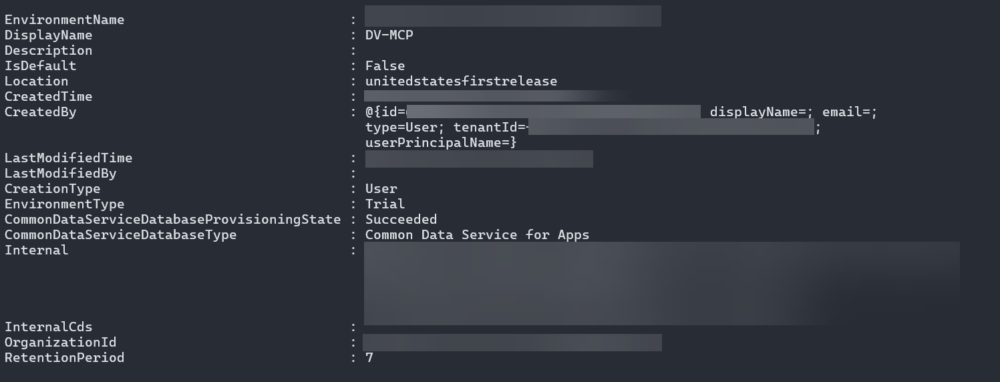
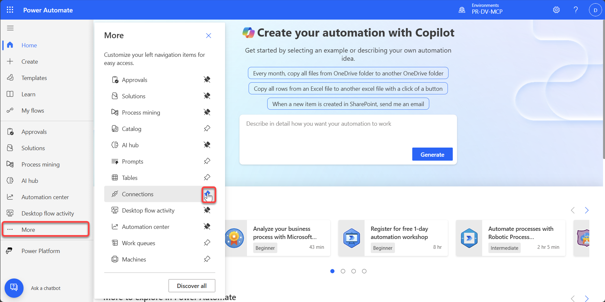
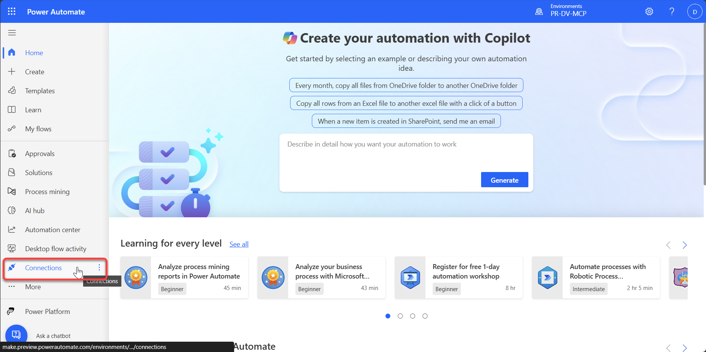
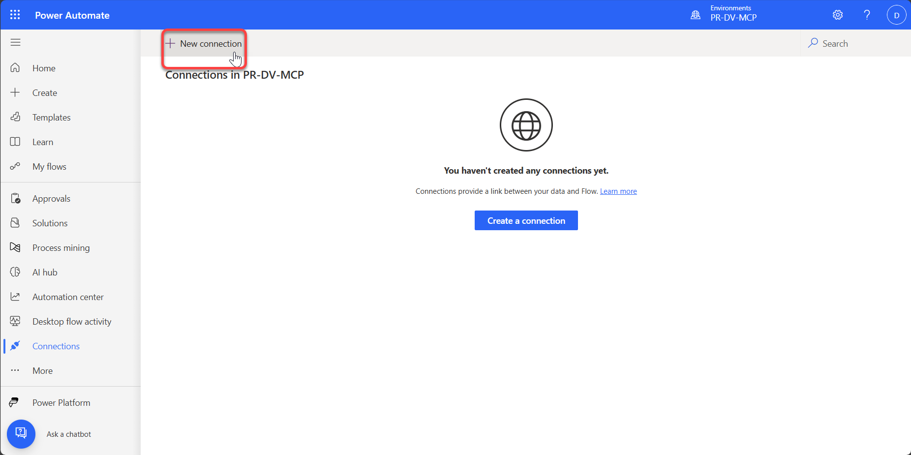
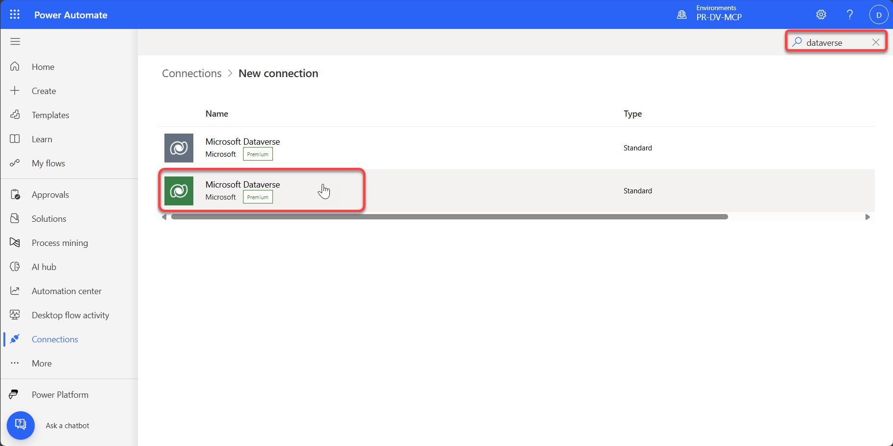
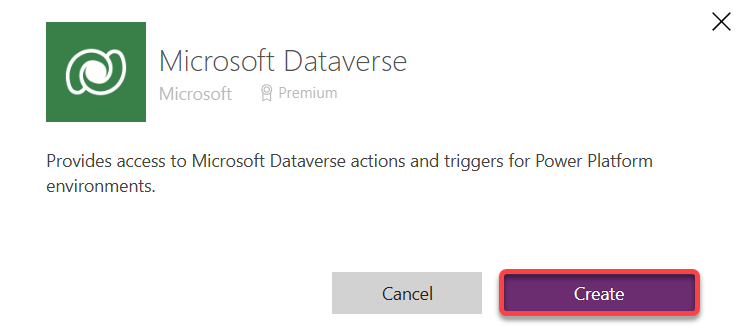
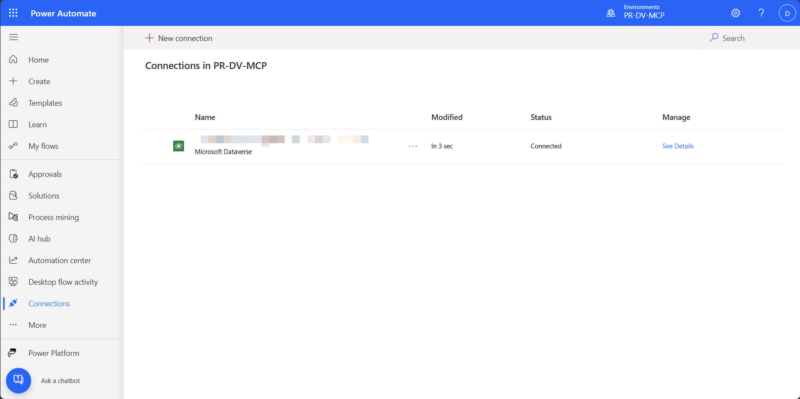
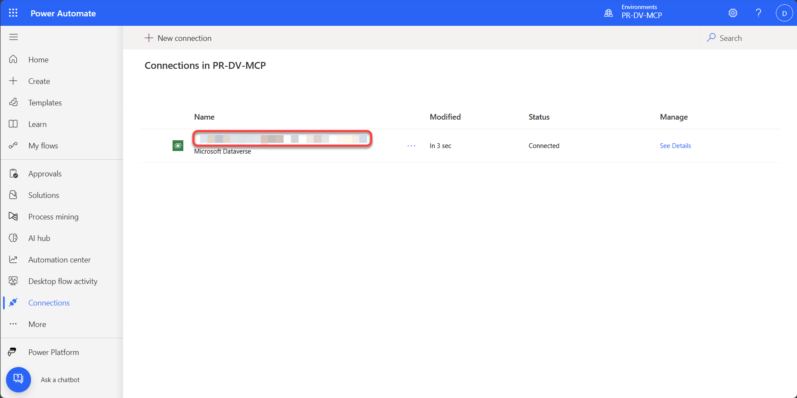
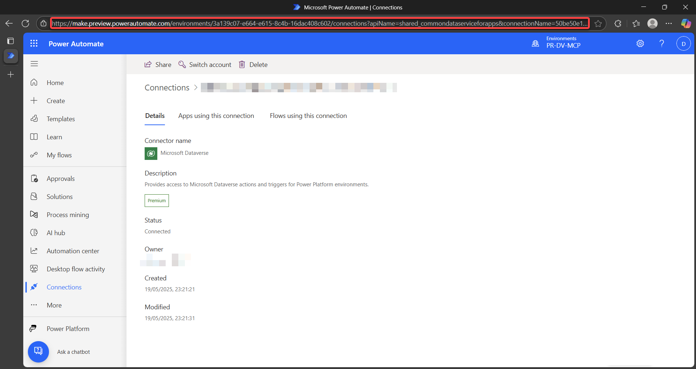
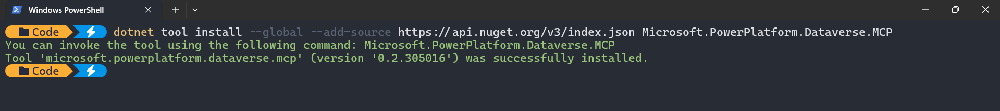

# 🛠️ Lab 01 - Setting up your Dataverse environment & install the Dataverse MCP Local Proxy
In this lab, you will learn how to setup a Dataverse environment so that you can use the Dataverse MCP Server. Also, you will learn how to install the Dataverse Model Context Protocol server.

## Provision Dataverse environment
Open `Terminal` or `PowerShell` on your machine in the `Run as Administrator` mode. Press the `Windows key` and type `Terminal`. Right-click and select **Run as Administrator**.

Get the Power Apps admin module by running the following command in the terminal:

```powershell
Install-Module -Name Microsoft.PowerApps.Administration.PowerShell
```

After completing this step, run following command (you can stay in the same Terminal/PowerShell window). You need to pass LocationName as "unitedstatesfirstrelease" and provide a friendly name for your environment. You will be prompted for your credentials, please remember which one you use to complete this step. You will need it for the configuration of the environment.

```powershell
New-AdminPowerAppEnvironment -DisplayName '<friendly name>' -Location unitedstatesfirstrelease -EnvironmentSku Trial -ProvisionDatabase
```

At successful run, you will see a list of attributes of your newly provisioned environment. This typically includes EnvironmentName, DisplayName, Location (expected value is unitedstatesfirstrelease), CommonDataServiceDatabaseProvisioningState (expected value is succeeded).



> [!IMPORTANT]
> Please note both EnvironmentName, DisplayName & Tenant ID (Which is part of the created by column) for later steps.

## Configuring your Dataverse environment
You may need to upgrade the version of the "Microsoft Dynamics 365 – PowerAIExtensions" solution in the environment.

1.	Navigate to the Power Platform Admin Center at https://admin.powerplatform.microsoft.com/
1.	Select your environment from the environments list.
1.	Select Resources > Dynamics 365 Apps from the top menu (Don't select Dynamics 365 Apps on the left menu)
1.	Next to "Microsoft Dynamics 365 – PowerAIExtensions" if you see an "Update Available" link, select it and upgrade the solution.

## Create a connection to Dataverse on your environment
Navigate to https://make.powerautomate.com – just open another tab in the browser with Dataverse maker portal. If necessary, change to the correct environment by selecting it from the top right again. 

Select `More` and pin `Connections` by selecting the thumbtack to make sure the connections are pinned to the left navigation.



Select `Connections` on the left navigation.



Click **+ New connection** at the top, type `Dataverse` into the search box



Select the one with the green Dataverse icon. 



Select create in the pop up:



Select your user to complete. You will see something like this: 



> [!TIP]
> Note the user name in the connection Name – should be same as one you used already to provision Dataverse.

Select the username to open the connection.



Copy the Connection URL from the address bar and save it somewhere safe.



## Configure Dataverse MCP
First off, please install .NET SDK 8.0 with this Power Shell command.

1.	Install the .NET SDK 8.0 either from Downloads  or with this Power Shell command.

    ```powershell
    winget install Microsoft.DotNet.SDK.8
    ```

Go back to the Terminal window (or start new one as administrator) and run following command:

```powershell
dotnet tool install --global --add-source https://api.nuget.org/v3/index.json Microsoft.PowerPlatform.Dataverse.MCP
```



Great job! You’ve successfully completed configuration of Dataverse MCP server!

## Continue with Lab 02
👉 Go to [Lab 02](../lab02/README.md)