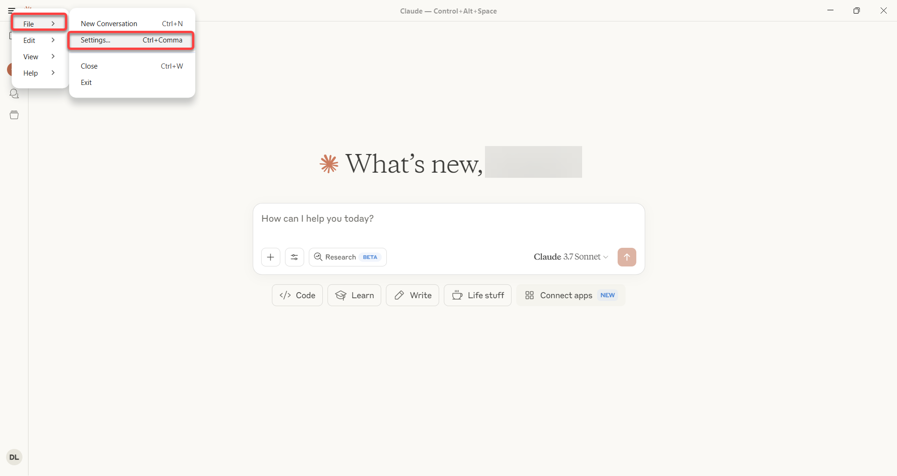
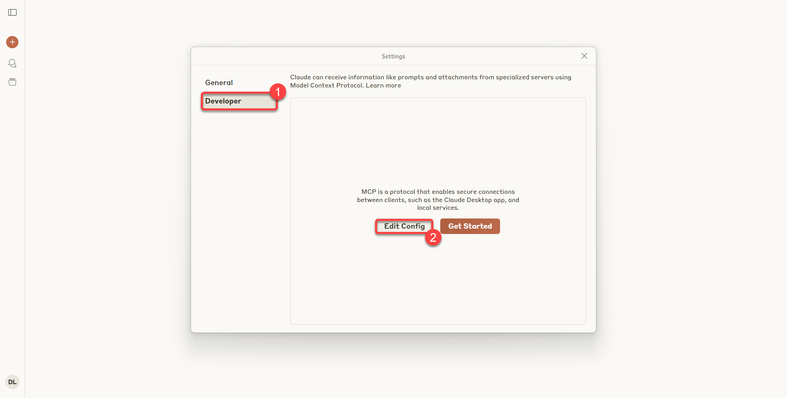
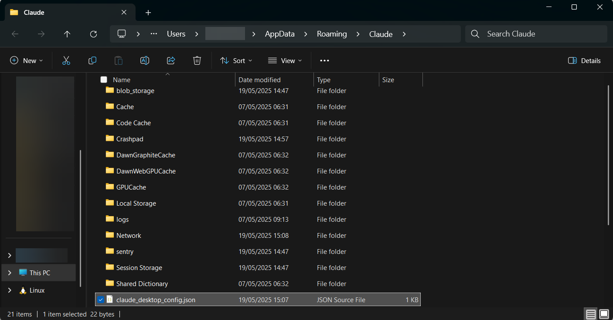
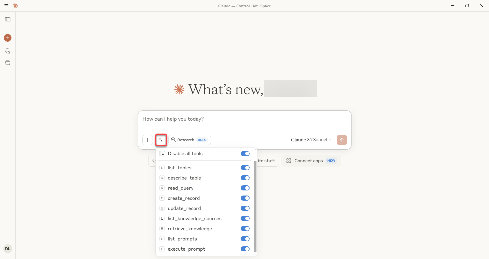
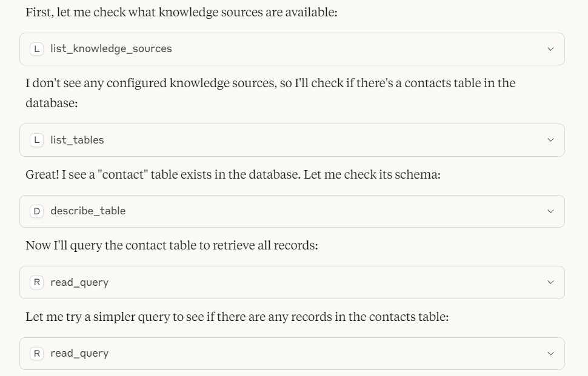

# 🏋️‍♂️ Lab 02 - Use the Dataverse MCP server with Claude
In this lab, you will learn how to use the Dataverse MCP server with Claude. You will be guided through the setup steps and a couple of scenarios will be shown.

## Download Claude
If you have not already done so, download and install Claude desktop from [here](https://claude.ai/download). You can do this at any time as it is independent from other steps. The configuration of Claude desktop to connect with the Dataverse MCP server is the last step. You should be able to find and launch Claude from your desktop.

## Configure Claude desktop
Launch Claude desktop and navigate to File -> Settings



Select `Developer` & `Edit Config`



You will be launched into Claude directory:



Open `claude_desktop_config.json` in Visual Studio Code and paste the following configuration in the json file. Make sure to replace `<Connection URL from Lab 01>` by the Connection URL you copied from the Power Automate website and replace `<Tenant Id>` by the Tenant ID you copied from the session details in Power Platform Admin Center (all in lab 01).

```json
{
  "mcpServers": {
    "Dataverse MCP Server": {
      "command": "Microsoft.PowerPlatform.Dataverse.MCP",
      "args": [
        "--ConnectionUrl",
        "<Connection URL from Lab 01>",
        "--MCPServerName",
        "DataverseMCPServer",
        "--TenantId",
        "<Tenant Id>",
        "--EnableHttpLogging",
        "true",
        "--EnableMsalLogging",
        "false",
        "--Debug",
        "false",
        "--BackendProtocol",
        "HTTP"
      ]
    }
  }
}
```

Your file should look like one below:


Save this file and go back to Claude. **Exit** Claude – don't just close the window, but use the menu to exit.

## Use the Dataverse MCP Server with Claude
Reopen Claude. Now you have configured the Dataverse MCP Server, this should give two prompts to authenticate. **Use the same account** you used for Dataverse. Once that is complete, you should see MCP Server that you’ve configured in `claude_desktop_config.json` in Claude. Once authentication completed for your desktop machine, you won’t be prompted again for connecting to the same environment in the future.

Let's explore what is available in the Dataverse MCP server tools. Select the `Search and tools` icon and select the `Dataverse MCP server`. This will open the tools for you:



Let's try if the connection is working and send the following prompt:

```
List tables in Dataverse
```

The first time you run a tool, Claude will ask you if you want to allow the tool to run (once or always), or to decline.


You should see a response like the following:

```
Great! I've retrieved a list of all tables in your Dataverse database. There are many tables available. Here's a selection of some common tables that might be useful:

1. account
2. contact
3. annotation
4. email
5. task
6. appointment
7. opportunity
8. lead
9. product
10. queue
11. systemuser
12. team
13. businessunit
14. workflow
15. activitypointer

These are just a few of the many tables available in your Dataverse. If you'd like to explore a specific table in more detail, I can help you describe its schema or run queries to see the data it contains. Is there a particular table you're interested in learning more about?
```

> [!NOTE]
> It could be that Claude will first trigger the list_knowledge_source tool. Don't worry about that, because it will later trigger the list_tables tool.

Now, let's explore the contact table.

```
List the rows in the contacts table.
```

Currently, the Dataverse tables are empty. That means you should get a message back that there are no available items.

Your response could look something like this:

```
I've checked the contacts table in your Dataverse database, and currently there are no records in the table. The table exists with a comprehensive schema that includes fields for contact information such as:

- First name, last name, and full name
- Email addresses (up to 3)
- Phone numbers (multiple options including mobile, business, home)
- Job title and department
- Address information (up to 3 addresses with details like city, state, country)
- And many other standard CRM contact fields

However, the query returned a count of 0, indicating that no contact records have been created yet in the system.

Would you like me to help you create a new contact record in the table?
```

> [!NOTE]
> You might have noticed Claude performed a lot of calls to the tools. It will try out a bunch of steps to improve the action it will take. For instance, it will first list the tables to see if there is a table called contacts, and then it will describe the contacts table to get the columns in that table.

See an example of the calls in the image below:



Next, let's create something! Since your table is now empty, you might want to add some data. Use the same chat you used for getting the data from the contacts table and enter the following prompt:

```
Please create 10 example items in the contact table in Dataverse. Clearly mark them with (sample).
```

Claude remembers the context of the earlier calls in the chat, so it will immediately start creating records one by one. At the end, it will query the table to verify if the records are indeed created:

```
I've successfully created 10 sample contacts in your Dataverse contacts table. Here's a summary of the contacts created, all clearly marked with "(sample)" in their first names:

1. John (sample) Smith - Marketing Manager in Marketing Dept
    - Email: john.smith@example.com
    - Phone: 555-123-4567

2. Sarah (sample) Johnson - Sales Director in Sales Dept
    - Email: sarah.johnson@example.com
    - Phone: 555-234-5678

3. Michael (sample) Brown - IT Manager in Information Technology Dept
    - Email: michael.brown@example.com
    - Phone: 555-345-6789

4. Emily (sample) Davis - HR Specialist in Human Resources Dept
    - Email: emily.davis@example.com
    - Phone: 555-456-7890

5. David (sample) Wilson - Finance Director in Finance Dept
    - Email: david.wilson@example.com
    - Phone: 555-567-8901

6. Jessica (sample) Martinez - Product Manager in Product Development Dept
    - Email: jessica.martinez@example.com
    - Phone: 555-678-9012

7. Robert (sample) Taylor - Operations Manager in Operations Dept
    - Email: robert.taylor@example.com
    - Phone: 555-789-0123

8. Jennifer (sample) Anderson - Customer Service Rep in Customer Service Dept
    - Email: jennifer.anderson@example.com
    - Phone: 555-890-1234

9. Christopher (sample) Thomas - Research Analyst in Research Dept
    - Email: christopher.thomas@example.com
    - Phone: 555-901-2345

10. Amanda (sample) Garcia - Legal Counsel in Legal Dept
    - Email: amanda.garcia@example.com
    - Phone: 555-012-3456

All contacts have been successfully created and stored in the Dataverse contacts table with their unique contact IDs.
```

There are lots of other tools available, so make sure to explore these all in Claude!

## Continue with Lab 03!
👉 Go to [Lab 03](../lab03/README.md)
