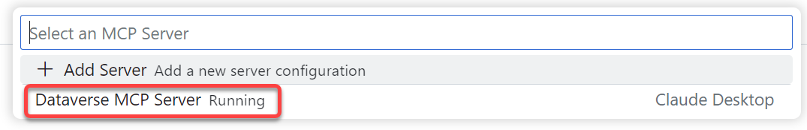
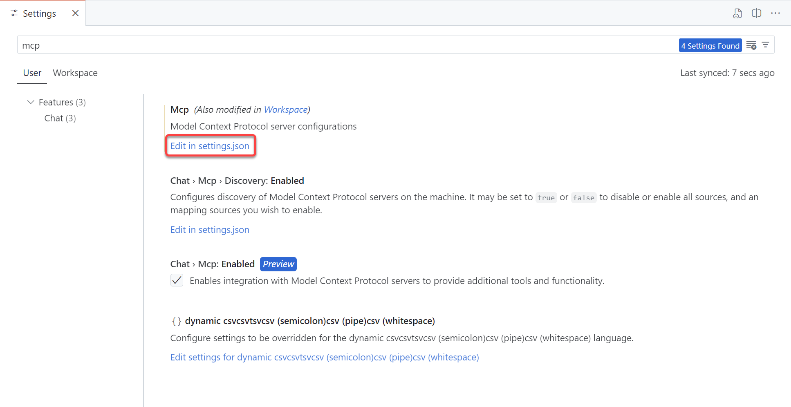
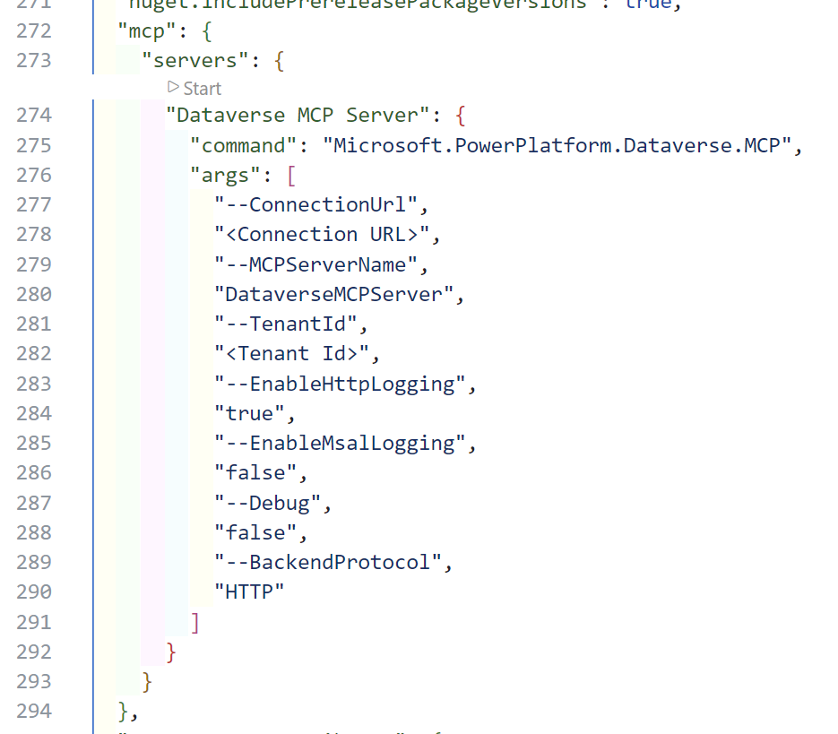

# 🧑🏽‍💻 Lab 03 - Use the Dataverse MCP server with Visual Studio Code

In this lab, you will learn about how to use the Dataverse MCP server with Visual Studio Code. This lab will build on the earlier labs, so make sure to finish those as well.

## ⚙️ Configure Visual Studio Code to use the Dataverse MCP server

If you don’t have VS Code installed, [download Visual Studio Code - Mac, Linux, Windows](https://code.visualstudio.com/download).

1. In VS Code, open the command palette using Ctrl+Shift+P or **View** > **Command Palette**. Type *MCP:* and a list of relevant MCP commands are displayed, such as MCP: List Servers and MCP: Add Servers.  
1. If you have configured the Dataverse MCP server as described earlier in the [Claude desktop](#configure-and-use-the-dataverse-mcp-server-in-claude) step and your VS Code MCP setting is set as `"chat.mcp.discovery.enabled": true`, VS Code is able to discover it. For example, when you choose **MCP: List Servers**, the MCP server, such as **Dataverse MCP Server Running**, is displayed.

   

   If the Dataverse MCP server isn't running, select the server and then select **Start Server**. Observe the server start in the **Output** window of VS Code.

### Configure the Dataverse MCP server in VS Code

These instructions help you configure a Dataverse MCP server at the user setting level.

1. In VS Code, go to **Manage** (gear on lower left) > **Settings** or CTRL+, and then type *MCP*.
1. **Mcp** is listed under the **User** tab. Select **Edit in settings.json**.
   
1. Add the Dataverse MCP configuration text inside the mcp "servers" setting following the curly brace.
   

   ```json
   "Dataverse MCP Server": {
   "command": "Microsoft.PowerPlatform.Dataverse.MCP",
   "args": [
     "--ConnectionUrl",
     "<Connection URL>",
     "--MCPServerName",
     "DataverseMCPServer",
     "--TenantId",
     "<Tenant Id>",
     "--EnableHttpLogging",
     "true",
     "--EnableMsalLogging",
     "false",
     "--Debug",
     "false",
     "--BackendProtocol",
     "HTTP"
    ]
   }
   ```

1. Replace `<Connection URL>` and `<Tenant Id>`

> [!NOTE]
> When the MCP server is configured correctly in settings.json, you notice a status like **Start**. This means that syntactically, it's correct and you can start the MCP server. In case it doesn’t show Start, you can go to **Command Palette** (Ctrl+Shift+P), type *MCP:* and then select **MCP: List Servers**. You should see the Dataverse MCP server there.

In VS Code, open GitHub Copilot by selecting the **GitHub Copilot icon** or use **ctrl+alt+I**.

Change GitHub Copilot from ask mode to agent mode.


Now you can select the tools icon to open the available tools.


Depending on your extensions, the list can differ, but the **Dataverse MCP Server** should be listed with a text **from Claude Desktop** or if you manually added the MCP server to the settings, it should show without the `from Claude Desktop` text.


Make sure the tools are selected, and select **OK**.

## 🧠 Use the Dataverse MCP server tools

Let's start by asking again about the tables in Dataverse:

```
List tables from Dataverse
```

GitHub Copilot will ask you if you want to continue running the **list_tables** tool. 


Select **Continue** and you should see something like the following response:


Now, let's list the items in the contact table again by running the following prompt:

```
List items in the contact table
```

Select **Continue** to run the tools needed. It will return items, but it might not return all the items in the table. If that happens, make sure to ask for 10 items. That should return all 10 items.

```
Here are 10 records from the contact table:

John (sample) Smith
Email: john.smith@example.com
Job Title: Marketing Manager
Phone: 555-123-4567

Sarah (sample) Johnson
Email: sarah.johnson@example.com
Job Title: Sales Director
Phone: 555-234-5678

Michael (sample) Brown
Email: michael.brown@example.com
Job Title: IT Manager
Phone: 555-345-6789

Emily (sample) Davis
Email: emily.davis@example.com
Job Title: HR Specialist
Phone: 555-456-7890

David (sample) Wilson
Email: david.wilson@example.com
Job Title: Finance Director
Phone: 555-567-8901

Jessica (sample) Martinez
Email: jessica.martinez@example.com
Job Title: Product Manager
Phone: 555-678-9012

Robert (sample) Taylor
Email: robert.taylor@example.com
Job Title: Operations Manager
Phone: 555-789-0123

Jennifer (sample) Anderson
Email: jennifer.anderson@example.com
Job Title: Customer Service Rep
Phone: 555-890-1234

Christopher (sample) Thomas
Email: christopher.thomas@example.com
Job Title: Research Analyst
Phone: 555-901-2345

Amanda (sample) Garcia
Email: amanda.garcia@example.com
Job Title: Legal Counsel
Phone: 555-012-3456

Let me know if you need further assistance!
```

Let's update the contacts, since the country is not filled.

```
I forgot to add the country to the contacts in Dataverse. Can you please add the country United States to all 10 contacts?
```

This will update the items in our contacts table.

> [!NOTE]
> Depending on the model used, it can sometimes fail the update because of not having the correct contactid GUIDs. You can easily solve this by sending the prompt 'Please get the IDs from the contacts table'.


To verify the actions, run the following prompt:

```
Can you list all contacts in Dataverse with their respective countries?
```

This should lead to a response like this:


## 🗣️ Feedback

In the upcoming months we will add more labs to this repository, so please stay tuned! Hopefully you liked the lab. Please take the time to fill in our [feedback form](https://aka.ms/Dataverse/MCP/Lab/Feedback) to tell us how we can improve!

## ✅ End of the labs!

You finished the labs! Make sure to try out the Dataverse MCP server in your day to day work!

👉 Go back to the [lab readme](../README.md)
